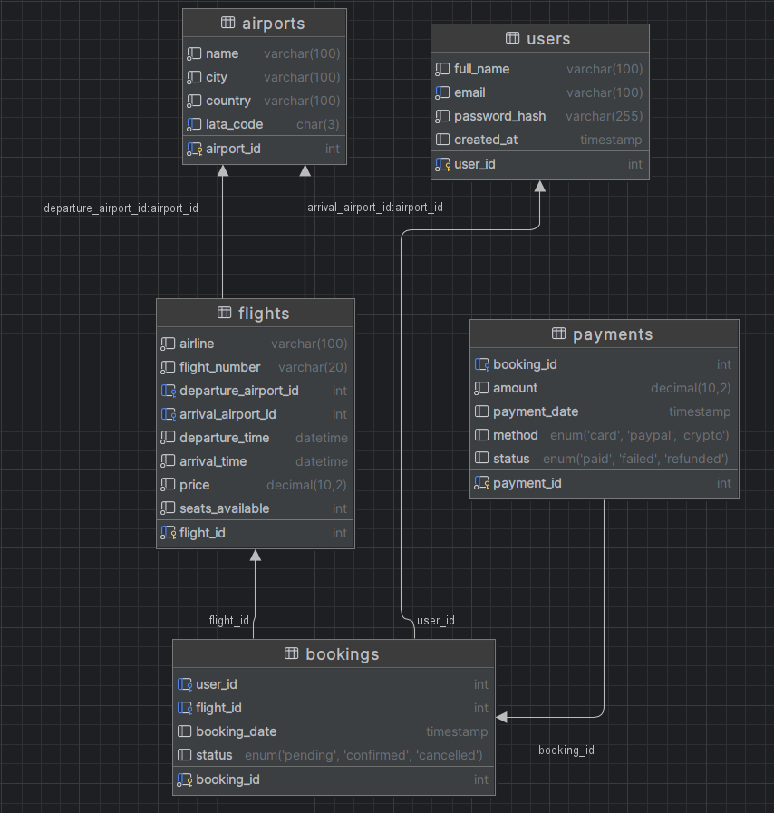

#  SkyFly — Airline Ticket Booking Web App  

**Course:** Web Programming  
**Student:** Din Bajrić  
**Milestone 1:** Frontend SPA Setup & Database Schema  

---

##  Overview  
SkyFly is a single-page web application for booking airline tickets.  
Users can search flights, view details, register/login, and go through the booking process.  

---

##  Database Schema (Planning Only)

### Entities
1. **Users** — user info and credentials  
2. **Flights** — route, airline, date, and price  
3. **Bookings** — connection between user and flight  
4. **Airports** — origin and destination airports  
5. **Payments** — records of payment transactions  

### Relationships
- `Users` 1—M `Bookings`  
- `Flights` 1—M `Bookings`  
- `Airports` 1—M `Flights` (origin/destination)  
- `Bookings` 1—1 `Payments`

---

## 🖼️ ER Diagram

---